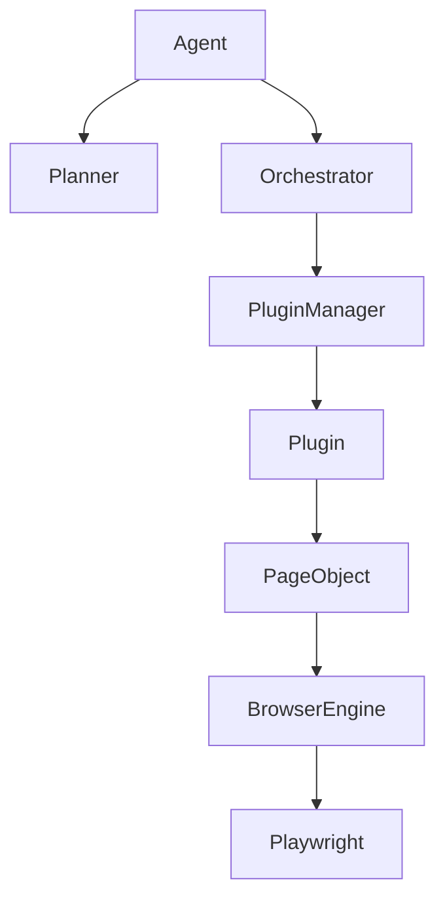

# AgentForge Architecture

AgentForge is designed as a layer-cake architecture with strict dependency boundaries:

## Layers

1. **Agent Loop**: Observe -> Evaluate -> Plan -> Execute.
2. **Planner**: Transforms natural language intents into Execution Requests.
3. **Execution Orchestrator**: Manages resolution, execution, retries, and metric tracking.
4. **Plugin Framework**: Isolated packages (`bookmyshow`, etc.) providing domain-specific workflows and Page Objects.
5. **Browser Engine**: An abstraction over `Playwright` to decouple the plugins from specific automation APIs. Includes advanced canvas automation (e.g. `KonvaAdapter`) via `JavaScriptBridge`.
